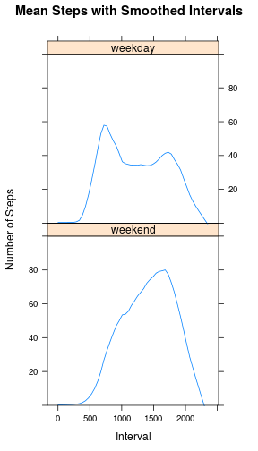

<div style="text-align: center"><h1 >Reproducible Data: Peer Review Assignment 1</h1>
<h4>Clyde Tressler </br>November 5, 2015</h4>
</div>

<h3>Reading the Data</h3>
First we load the activity monitoring data from the csv file. We use strings as character vectors to facilitate conversion to POSIX dates. 


```r
setwd('~/RepData_PeerAssessment1')
dat <- read.csv('activity.csv', stringsAsFactors = FALSE)
dat$date <- as.Date(dat$date)
str(dat)
```

```
## 'data.frame':	17568 obs. of  3 variables:
##  $ steps   : int  NA NA NA NA NA NA NA NA NA NA ...
##  $ date    : Date, format: "2012-10-01" "2012-10-01" ...
##  $ interval: int  0 5 10 15 20 25 30 35 40 45 ...
```
<h3>Analysis of Raw Data</h3>
Below we group interval observations by day, then plot a histogram of steps by day and report the mean and median number of steps per day. NA observations are removed when summing the interval data. The dplyr library is used to group and summarize the intervals by date.

```r
library(dplyr)
```


```r
date_grouped <- group_by(dat, date)
steps <- summarise_each(date_grouped, funs(sum(., na.rm = TRUE)), steps)
head(steps)
```

```
## Source: local data frame [6 x 2]
## 
##         date steps
## 1 2012-10-01     0
## 2 2012-10-02   126
## 3 2012-10-03 11352
## 4 2012-10-04 12116
## 5 2012-10-05 13294
## 6 2012-10-06 15420
```

```r
hist(steps$steps, main = 'Histogram of Steps per Day', xlab = 'Number of Steps', ylim=c(0,20),
     col='steelblue', breaks=10)
```

 

```r
est_mean <- mean(steps$steps)
est_median <- median(steps$steps)
```


```r
est_mean
```

```
## [1] 9354.23
```

```r
est_median
```

```
## [1] 10395
```

Next we group the data by 5-minute interval values in order to visualize the average steps per interval over all days in the observations. 


```r
interval_grouped <- group_by(dat, interval)
interval_steps <- summarise_each(interval_grouped, funs(mean(., na.rm = TRUE)), steps)
head(interval_steps)
```

```
## Source: local data frame [6 x 2]
## 
##   interval     steps
## 1        0 1.7169811
## 2        5 0.3396226
## 3       10 0.1320755
## 4       15 0.1509434
## 5       20 0.0754717
## 6       25 2.0943396
```

```r
tail(interval_steps)
```

```
## Source: local data frame [6 x 2]
## 
##   interval     steps
## 1     2330 2.6037736
## 2     2335 4.6981132
## 3     2340 3.3018868
## 4     2345 0.6415094
## 5     2350 0.2264151
## 6     2355 1.0754717
```

```r
plot(interval_steps$interval, interval_steps$steps, main = 'Number of Steps per 5-minute Interval',
     xlab = 'Interval', col='steelblue', type = 'l', ylab = 'Number of Steps', xlim=c(0,2500))
```

 

We verify that the number of intervals observed corresponds to 24 hours and then identify the interval with the maximum number of steps:

```r
length(unique((dat$interval)))/12
```

```
## [1] 24
```

```r
max_steps <- subset(interval_steps, steps==max(steps))
```
Maximum number of steps is 206.17 during interval 835.  

Next we calculate the number of NA observations in the dataset:

```r
sum(is.na(dat$steps))
```

```
## [1] 2304
```
<h3>Imputing Values for Missing Observations</h3>
Now we use vector recycling in R to quickly assign the step count means for each interval as a column in the original data frame, and then add another column to impute the missing values of the step observations by substituting the mean value when an NA is present in the original data.


```r
unique(dat$interval == interval_steps$interval) #check to see the intervals all match
```

```
## [1] TRUE
```

```r
dat$int_means <- interval_steps$steps
dat$imputed_steps <- ifelse(is.na(dat$steps), dat$int_means, dat$steps)
```
Let's make sure it worked:

```r
head(dat)
```

```
##   steps       date interval int_means imputed_steps
## 1    NA 2012-10-01        0 1.7169811     1.7169811
## 2    NA 2012-10-01        5 0.3396226     0.3396226
## 3    NA 2012-10-01       10 0.1320755     0.1320755
## 4    NA 2012-10-01       15 0.1509434     0.1509434
## 5    NA 2012-10-01       20 0.0754717     0.0754717
## 6    NA 2012-10-01       25 2.0943396     2.0943396
```

```r
tail(dat)
```

```
##       steps       date interval int_means imputed_steps
## 17563    NA 2012-11-30     2330 2.6037736     2.6037736
## 17564    NA 2012-11-30     2335 4.6981132     4.6981132
## 17565    NA 2012-11-30     2340 3.3018868     3.3018868
## 17566    NA 2012-11-30     2345 0.6415094     0.6415094
## 17567    NA 2012-11-30     2350 0.2264151     0.2264151
## 17568    NA 2012-11-30     2355 1.0754717     1.0754717
```

```r
dat[14000:14006,] #looks right!
```

```
##       steps       date interval int_means imputed_steps
## 14000     0 2012-11-18     1435  27.50943             0
## 14001    39 2012-11-18     1440  17.11321            39
## 14002    72 2012-11-18     1445  26.07547            72
## 14003    46 2012-11-18     1450  43.62264            46
## 14004     4 2012-11-18     1455  43.77358             4
## 14005     0 2012-11-18     1500  30.01887             0
## 14006     0 2012-11-18     1505  36.07547             0
```

Now we repeat the analyses using the imputed data:

```r
date_grouped <- group_by(dat, date)
imputed_steps <- summarise_each(date_grouped, funs(sum(.)), imputed_steps)
head(imputed_steps)
```

```
## Source: local data frame [6 x 2]
## 
##         date imputed_steps
## 1 2012-10-01      10766.19
## 2 2012-10-02        126.00
## 3 2012-10-03      11352.00
## 4 2012-10-04      12116.00
## 5 2012-10-05      13294.00
## 6 2012-10-06      15420.00
```

```r
hist(imputed_steps$imputed_steps, main = 'Histogram of Steps per Day',
     xlab = 'Number of Steps', ylim=c(0,25), col='steelblue', breaks=10)
```

 

```r
mean(imputed_steps$imputed_steps)
```

```
## [1] 10766.19
```

```r
median(imputed_steps$imputed_steps)
```

```
## [1] 10766.19
```

Are the values for the mean and median with the missing values filled-in the same as the previous calculations?

```r
est_mean == mean(imputed_steps$imputed_steps)
```

```
## [1] FALSE
```

```r
est_median == median(imputed_steps$imputed_steps)
```

```
## [1] FALSE
```
No, the values are different. In this case, replacing the missing data has resulted in step counts that seem to be more normally distributed around the mean.

<h3>Weekday Activity vs Weekend Activity</h3>
Now we examine whether activity patterns are different on weekends versus weekdays. We add a column using a factor variable to distinguish weekdays from weekends and a 'day of week' column to visually verify the factor values. We provide panel plots of the interval data for weekends and weekdays:

```r
weekends <- c('Saturday', 'Sunday')
dat$dow <- weekdays(dat$date)
dat$day <- factor((weekdays(dat$date) %in% weekends), levels=c(TRUE, FALSE), labels=c('weekend', 'weekday'))
interval_grouped <- group_by(dat, interval, day)
interval_steps <- summarise_each(interval_grouped, funs(mean(.)), imputed_steps)
library(lattice)
xyplot(interval_steps$imputed_steps ~ interval_steps$interval | day, data=interval_steps,
       layout=c(1,2), main="Mean Steps for 5-Minute Intervals for Weekdays vs Weekends",
       xlab="Interval", ylab="Number of Steps", type=c("l","l"))
```

 

Now we use a smoothing filter to better understand the important features of the plots:

```r
xyplot(interval_steps$imputed_steps ~ interval_steps$interval | day, data=interval_steps,
       layout=c(1,2), main="Mean Steps with Smoothed Intervals", xlab="Interval",
       ylab="Number of Steps", type=c("smooth","smooth"), span=.25, ylim = c(0,100))
```

 

<h3>Interpretation</h3>
The plots show that the weekday step counts peak early in the day, plateau for some hours, and then increase later in the day. The weekend step counts build quickly and do not plateau. This seems consistent with a traditional 40-hour work week schedule.

